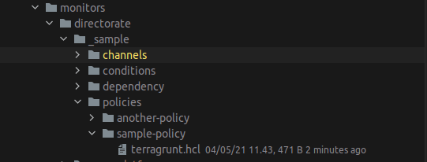

# New Relic

## Dashboard

Dashboard is an open board feature by newrelic, so we can create custom dashboard with html tag.
we can easily manage information as we want.

for open board we need open board package id from new relic, put at environment variable

```shell
OPEN_BOARD_PACKAGE_ID=xxxx-xxx-xxx
```
current structure dashboard contain company name, and the journeys of the system, we can have multiple journey under
1 company

```shell
dashboards
│   └── company_name
│       └── buyer_journey
│           └── board.hcl
```

for dashboard layout adopt column base layout so every box is under directorate name


in a box there is 3 indicator 
- success rate
- RPS
- Latency

### Sample Dashboard Code

```shell
name = "Example Exec Dashboard Testing"

row {
  group "Company Name" {
    section "Directorate Name A" {
      column {
        node {
          type = "red_module"
          name = "Sample"
          monitor = "monitors/directorate/_sample/conditions/home-page"
        }

      }
    }

    section "Directorate Name B" {
      column {
        node {
          type = "red_module"
          name = "Sample Upstream"
          monitor = "monitors/directorate/_sample/conditions/home-page"
        }
      }
    }
  }
}
```

- `row` represent of a row in dashboard, we can have multiple row, usually 1 row have 1 company
- `group` represent of 1 product and consist of multiple directorate
- `section` represent of directorate
- `column` is setup of layout separated by column inside section, so every box/node inside column the position will be in bottom previous box
- `node` is box that showing 3 aspect , RPS, Latency, and Success Rate
- `monitor` is the directory for source RPS, Latency, and Success Rate
- `type` is make differentiate `red_module` and `sr_module` (for now use red_module) red module required 3 source: rps, success-rate, latency. sr_module only success rate.

## Monitor

monitors directory is placement the source of node in dashboard, also channel for alerting,
set condition in each journey per directorate, set the drop rules and also policies of the open incident.

### Channel
- Channel is for alerting purpose, currently we have pagerduty , slack, email and threaded-slack (webhook)

### Conditions
- Condition is consist of 3 part latency , rps, and success rate the have input
    - `nrql_alert_condition_name` is name of condition
    - `nrql_alert_condition_description` is description of condition
    - `nrql_alert_condition_policy_ids` array of policies id
    - `nrql_alert_condition_query` query of condition RPS, Success Rate, Latency
    - `nrql_alert_condition_critical` set object of condition for critical
    - `nrql_alert_condition_warning` set object of condition warning
    
### Dependency
- Dependency is for support the channel, usually use for different resource of terraform

### Drop-Rules
- Dropping Rule is for apply filter to drop the data before goes to NRDB , usually use for reduce cost, and PII data

### Policies
- Policies is set rule for alerting if there is condition warning or critical, we can import the channel that we already create 


## How to Use
- `export NEW_RELIC_ACCOUNT_ID=xxxx`
- `export NEW_RELIC_API_KEY=XXX_XXXXX`
- `export OPEN_BOARD_PACKAGE_ID=XXX_XXX_XXX`

for creating executive dashboard specify the board (layout) setting file `src` and put `docID` docID wil be named in open board newrelic

```shell 
go run ./generator/main.go -src=./new-relic/dashboards/company_name/journey/board.hcl -docID=testing
```

for run `channel`, `conditions`, `dependency`, `drop-rules` and `policies` just run
```shell
terragrunt apply
```

before running this make sure all environment above is filled and also don't forget configuration of terraform state and lock
usually use object storage like s3 and etc.


## Step By Step Creating your dashboard

1. Define the layout at `new-relic/dashboards/company_name/your-journey/board.hcl`
   define layout that you want
   ```
   name = "Example Exec Dashboard Testing"

    row {
      group "Company Name" {
        section "Directorate Name A" {
          column {
            node {
              type = "red_module"
              name = "Sample"
              monitor = "monitors/directorate/_sample/conditions/home-page"
            }
    
            node {
              type = "red_module"
              name = "Sample Upstream"
              monitor = "monitors/directorate/_sample/conditions/product-page"
            }
          } // end column
        } // end section
      } // end group
    } // end row   
   
   ```
  
2. To Fill data related RPS, Latency and SuccessRate that already define above 
   `monitors/directorate/_sample/conditions/home-page` create directory conditions under your directorate
   and set name `home-page` like your funnel need
    
   there is 3 folder
   - latency
   - rps
   - success-rate

3. Fill the query related rps, latency, success-rate inside their folder with filename terragrunt.hcl
  sample of terragrunt.hcl
   ``` 
    include {
      path = find_in_parent_folders()
    }
    
    terraform {
      source = "git::git@github.com:tokopedia/obac.git//tf-module//new-relic//nrql-alert-condition"
    }
    
   // this part for set policy alerting in a conditions, the policy will have chanels or multiple channels
    dependency "policy" {
      config_path = "../../../policies/sample-policy"
    }
    
   // we can have multiple policy in one condition
    dependency "policy2" {
      config_path = "../../../policies/another-policy"
    }
    
    inputs = {
      // the name of condition
      nrql_alert_condition_name = "User Profiles Latency"
      // the description of condition , you can also mention team name at here for example @team-name
      nrql_alert_condition_description = "User Profiles Latency"
      // fill the policy id output in conditions
      nrql_alert_condition_policy_ids = [
         dependency.policy.outputs.id,
      ]
      nrql_alert_condition_enabled = true
      // set the query don't forget with alias Latency, RPS, SuccessRate
      nrql_alert_condition_query = "SELECT percentile(duration, 95) * 1000 as 'Latency' FROM Transaction where request.uri='/api/v1/users/profile' since 15 minutes ago"
    
      // set the alert condition critical
      nrql_alert_condition_critical = {
        // the value of operator can be below, above
        operator = "below"
        // thershold value
        threshold = 95
        // thershold duration in second unit
        threshold_duration = 300
        threshold_occurrences = "ALL"
      }
    
      // set the alert condition warning
      nrql_alert_condition_warning = {
        operator = "below"
        threshold = 99
        threshold_duration = 600
        threshold_occurrences = "ALL"
      }
    }
   ```
4. Fill the policy if you need send alert to your channel
    
   sample policy: 

   ```
   include {
      path = find_in_parent_folders()
    }
    
    terraform {
      source = "git::git@github.com:tokopedia/obac.git//tf-module//new-relic//alert-policy"
    }
    
    // definde the channel , like slack , pager duty or etc
    dependency "slack-channel-team-name" {
      config_path = "../../channels/slack/channel-executive"
    }
    
    
    inputs = {
      alert_policy_name = "Testing Policy #1"
    
      // set the policy channel ids base on your output 
      alert_policy_channel_ids = [
        dependency.slack-channel-team-name.outputs.id,
      ]
      
    } 
   ```
   
5. Define your channel for receive alert
    
   sample of channel :
   ``` 
   include {
      path = find_in_parent_folders()
    }
    
    terraform {
      source = "git::git@github.com:tokopedia/obac.git//tf-module//new-relic//alert-channel//slack"
    }
    
    inputs = {
   // define the name
      alert_channel_name = "Team Alert"
   // set the webhook url
      alert_slack_webhook_url = "https://someslackurl.com"
    }

   ```
6. Run your terragrunt for creating channel  go to your channel directory
 run `terragrunt plan` if ok then run `terragrunt apply`
   
7. Run your terragrunt for creating policy  go to your policy directory
 run `terragrunt plan` if ok then run `terragrunt apply`
   
8. Run your dashboard creation
    - `export NEW_RELIC_ACCOUNT_ID=xxxx`
    - `export NEW_RELIC_API_KEY=XXX_XXXXX`
    - `export OPEN_BOARD_PACKAGE_ID=XXX_XXX_XXX`
    
    get your package id in your url open board for example
    `https://one.newrelic.com/launcher/your-package-id`

    ```shell 
    go run ./generator/main.go -src=./new-relic/dashboards/company_name/journey/board.hcl -docID=testing
    ```
9. See the result at your newrelic open board


    